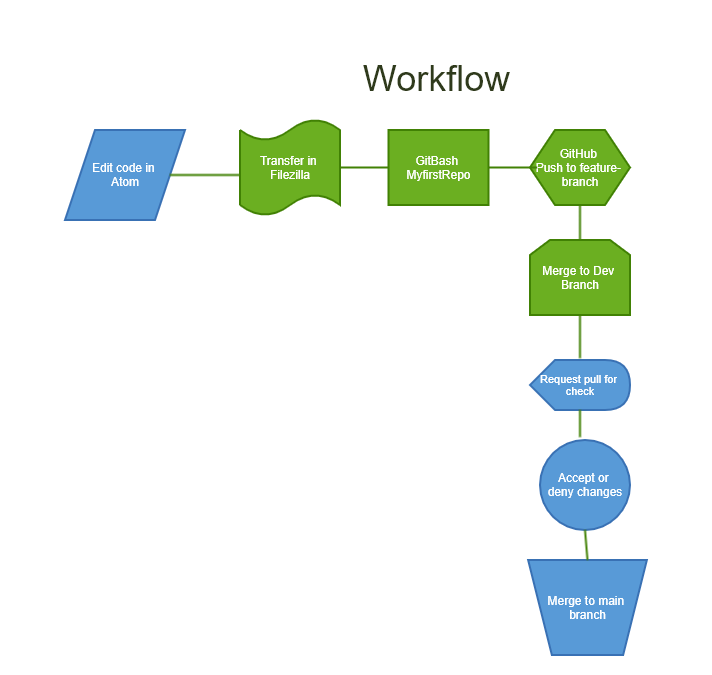

[.lead]
The Point Professional Website

[#img-attire]
.Professional Attire
image::Professional attire - Copy.jpg[Attire,300,200]

## Why have the Point Professional Website?
The Point Professional Website is available to students seeking a new profession, and needing the attire for interviews. Point Professional provides
professional clothing for rental to the students at low prices

## Application Environment Details
[horizontal]
Website:: Point Professional
Location:: Online
Environment:: Staging
PickupLocation:: Point Park University

## What programming languages are being used?
HTML, CSS, Javascript, JQruery, SQL

## Diagram of workflow for Implmentation of website
[#img-diagram]
.Workflow

